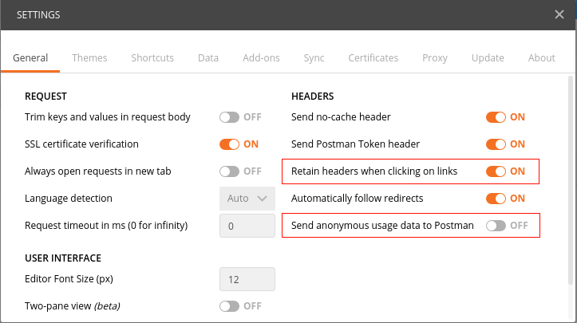
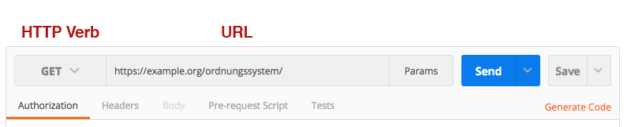
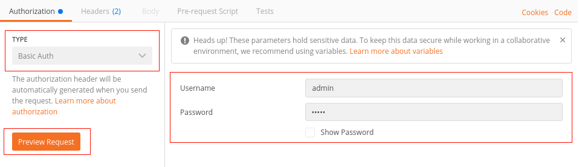
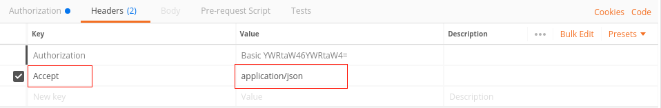
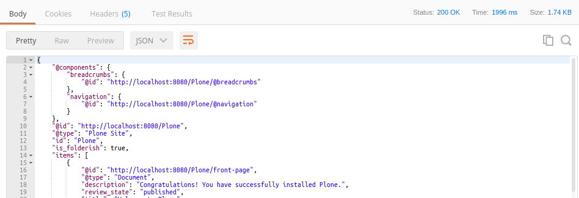

.. _exploring-api-postman-onboarding:

Explore the API using Postman
=============================

To discover the API interactively, using Postman_ is recommended.

.. admonition:: Note

    The Chrome-Extension version of Postman is deprecated and it is recommended to use the native app available instead.

Configuration
-------------

To easily follow links returned by request based on the API, 

* go to the menu under the |fawrench| wrench icon on the top right
* choose :guilabel:`Settings` 
* activate the option :guilabel:`Retain headers on clicking on links` by selecting :guilabel:`ON`:

|postman-retain-headers|

This option makes sure, once a :term:`HTTP-Header` is configured, it will be reused during following :term:`requests` , if these are initiated by clicking on links resulting from the initial :term:`request`. This way navigating the structure using the API becomes a snap.

The option :guilabel:`Send anonymous usage data to Postman` should be deactivated by setting to :guilabel:`OFF`.

Usage
-----

Choose the suitable :term:`HTTP Verb` to be used for your request. This can be selected using the Postman_ :menuselection:`HTTP Verb -> GET` drop-down menu. 

Enter the :term:`Object URL` of the object that should be the target of a request into the :guilabel:`URL` field right to the :term:`HTTP Verb`:

|postman-request|

Now set the appropriate HTTP headers. 

* The :term:`Authorization Header` for the authentication related to the right user
* The :term:`Accept Header` to initiate the right behaviour by the API related to this :term:`Request`.

----------

To set the :term:`Authorization Header`, there is a reserved tab, that is responsible to generate the final :term:`Header` based on the :term:`authentication method` and username + password.

You have to select

* in the drop-down menu :menuselection:`Basic Auth ->` the term :term:`Basic Auth` as the authentication method
* A valid existing user with appropriate permissions 

After providing these parameters you can create the resulting :term:`Authorization Header` and insert it into the prepared request by clicking on :guilabel:`Preview Request`.

|postman-basic-auth|

----------

Under the  :guilabel:`Headers` tab you now need to insert in the :term:`Accept Header`  application/json` header as well:

|postman-headers|

The request is now ready and can be send by clicking on :guilabel:`Send` button.

The :term:`Response` of the server is now displayed below the :term:`Request`. You can easily follow the links on the ``@id`` attributes by clicking on them. For every link Postman_ has prepared another request sharing the same headers that can be send again by licking on the  :guilabel:`Send` button.

|postman-response|

.. admonition:: Conclusion

    You can now explore the whole stucture of your application easily via the API using `GET` requests.

.. _rest-api-onboarding-glossary:

.. links

.. _Postman: http://www.getpostman.com/

.. |fawrench| raw:: html

    

